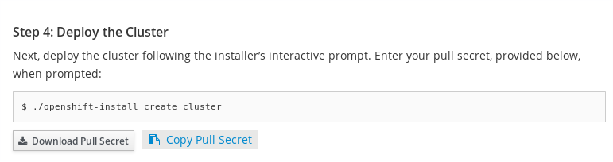

Install/Destroy OpenShift 4 on KVM using NextGen Installer
---------------------------------------------------------

Now, it is time to install OpenShift 4 on KVM. This doc show you the way to install and destroy OCP4 using NextGen installer.

Regarding access Web Console, new doc will explain it (TBD)

**Pre-requisites**

- [Build OpenShift Install](../Build_CLI/README.md)
- [Config KVM environment for OCP4](../Config_KVM/README.md)


**Prepare variable**

- SSH key
  - If you have, you can use it
  - If you don't have, create it (ssh-keygen)

- Pull Secret
  - Go to try.openshift.com
  - Clieck secret button
    

**Install OpenShift**

```
openshift-install create cluster --dir=libvirt --log-level=debug

? SSH Public Key */home/jooho/.ssh/id_rsa.pub*
? Platform *libvirt*
? Libvirt Connection URI *qemu+tcp://192.168.122.1/system*
? Base Domain *tt.testing*
? Cluster Name *ocp4*
? Pull Secret [? for help] *************************

```

*To check log*

- bootstrap master
  ```
  ssh core@ocp4-bootstrap.tt.testing
  ```

- master ndoe
  ```
  ssh core@ocp4-master-0.tt.testing
  ```


*How to know about these hostname?*
```
sudo cat /var/lib/libvirt/dnsmasq/tt0.*
```


**Destroy OpenShift**

```
openshift-install destroy cluster --dir=libvirt --log-level=debug
rm -rf ./libvirt
```
