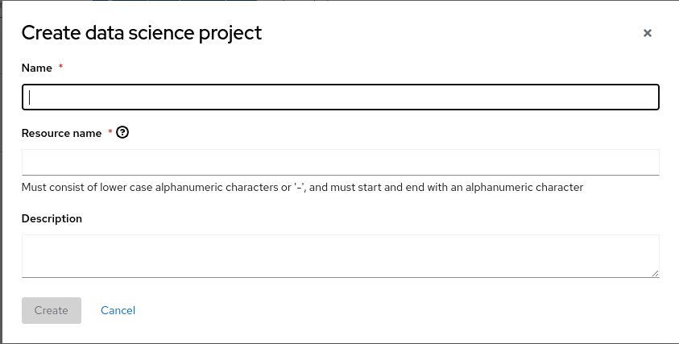
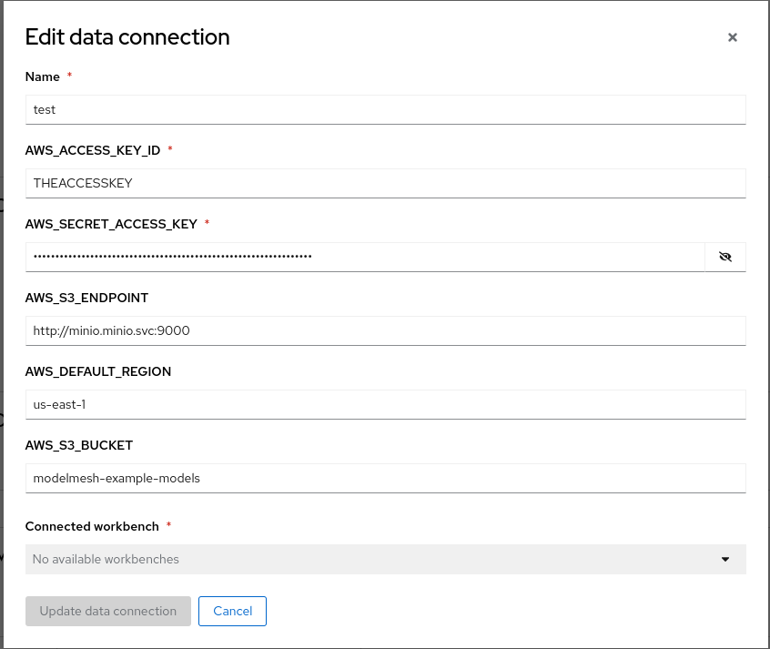
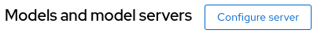
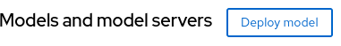
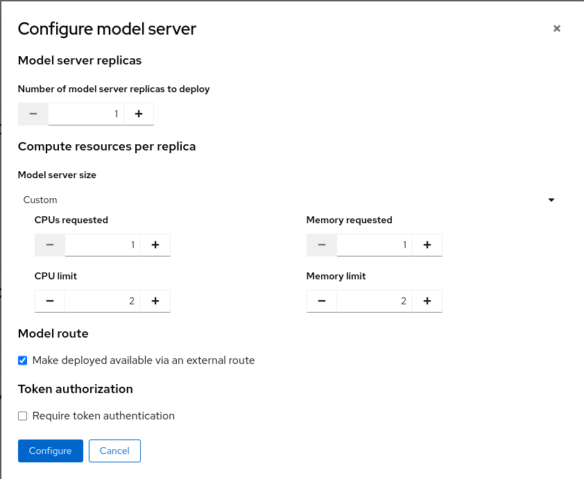

**Setup model using Minio**
./1.deploy-minio.sh

**Create a DSC**
URL: https://rhods-dashboard-redhat-ods-applications.apps-crc.testing

Name: test

**Create a connection**
Information
~~~
oc get secret storage-config -o yaml -n minio
~~~

**Configure server**

**Deploy model**

**TEST**
~~~
oc create -f sa_user.yaml
export Token=$(oc sa new-token user-one)
export HOST_NAME=$(oc get route test -n test -ojsonpath='{.spec.host}')
export HOST_PATH=$(oc get route test -n test -ojsonpath='{.spec.path}')

curl  -H "Authorization: Bearer ${Token}" --silent --location --fail --show-error --insecure https://${HOST_NAME}${HOST_PATH}/infer -d @input-onnx.json
~~~